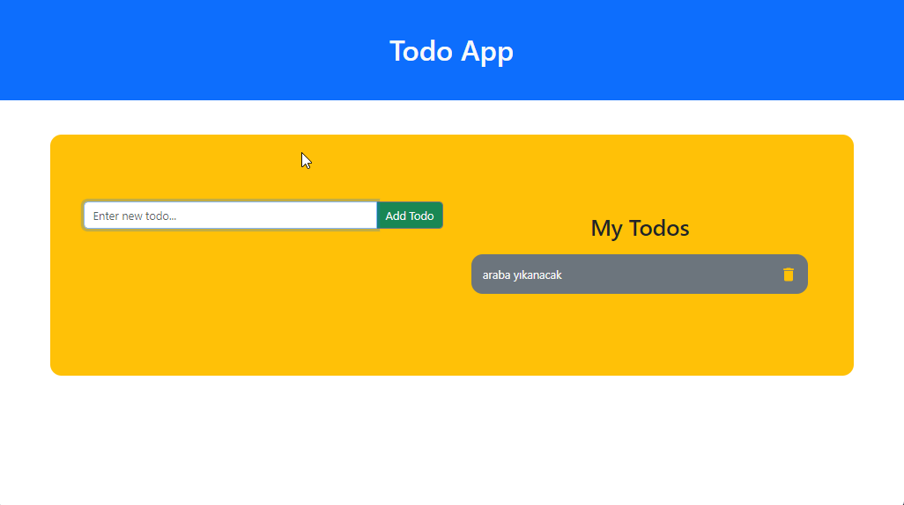

# Hi I'm Nurdoğan Bahadır 👋. Welcome to my Todo App Project with React.

This is a Todo App project. In this project the user can create a list of plans, save them, delete them and mark them as completed.

# Live Link of the Project

[Click Me](https://todo-app-nurdoganbahadir.netlify.app)

# Libraries and Technologies I use

- useState
- react bootstrap
- react icons
- uuid

# How to install

In the project directory, open the terminal and run:

### `npm install`

This will install the necessary dependencies. After that, you can run:

### `npm start`

# How does my project look

